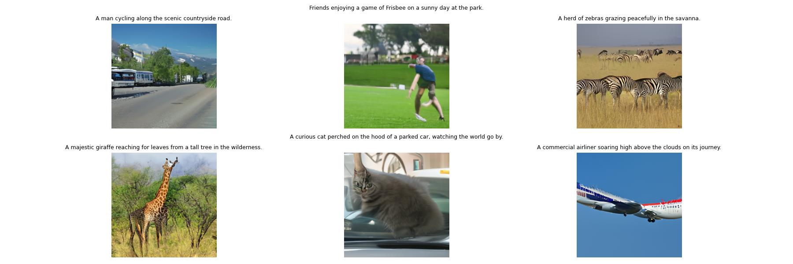

# Diffusion
Diffusion, Text-to-Image Generation with CNN-Transformer U-Net. The model architecture and design is my implementation of Google's Imagen from Saharia. "Photorealistic Text-to-Image Diffusion Models with Deep Language Understanding." arXiv, 2022.

The model was trained on the COCO Image Captions dataset, so the variety of producible images is limited to the image classes and prompts in the COCO dataset.

Starter code for using the COCO data set was taken from https://www.kaggle.com/code/nikhil7280/image-captioning-using-vit

Starter code for the diffusion algorithm was taken from https://keras.io/examples/generative/ddim/

# Model Architecture

# Samples

